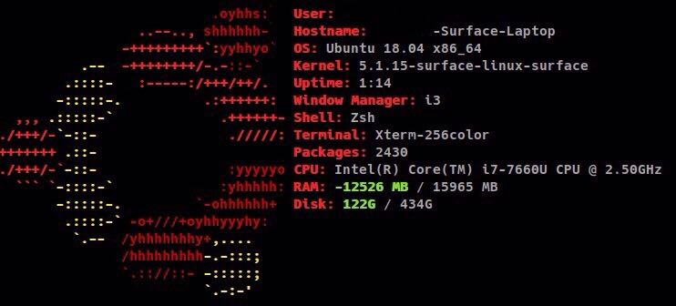

# 突然！私の開発環境

## マシン周り
- PC
  - 自作機(Core i7 4770K, RAM 16GB, SSD 128 x 2 RAID0, HDD 2TB, GTX 770)
  - Surface Laptop Gen1
- OS
  - Windows 10
  - Ubuntu 18.04 LTS
- キーボード
  - Razer BlackWidow Ultimate 2013
- マウス
  - steelseries RIVAL 110
 
　開発用のPCとして中学生の頃に組んだ自作機と昨年買ったSurface Laptopを使用しています。
以前は自作機で開発を行っておりましたが、最近はSurface Laptopのみで開発を行っております。
自作機のOSはWindows 10、Surface LaptopのOSはWindows 10とUbuntuのDual Bootです。
Surfaceは基本的にDual Boot不可なので、Mr. jakedayが作成したkernelを使用しています。
自作機は最近不調。来年にでも新しく組む予定。Broadwell以降のCPUわからん...。AMDが頑張ってるのは知ってる。
  
　自作機を組んだ当初、ネトゲ用途がメインだったので、キーボードはRazerのキーボードを購入しました。
青軸なので結構うるさいです。次に買うならHHKBかREALFORCEですかね。@magchoからは自作キーボードという沼を勧められております。
マウスはAnkerからsteelseriesに乗り換え。ゲーミングマウスですが普段使い用です。ゲームじゃなくても丁度良い。  
  
　Ubuntuに関しては、i3を最近入れて使っております。結構便利。Alt + Tabでレイテンシのある切り替えをしなくて済むのが非常に良いです。

## エディタ周り
- エディタ **Visual Studio Code (VSCode)**
  - インストール時から、ある程度形になっている
  - 拡張機能が豊富 
- 今のエディタにたどり着いた遍歴
  サクラエディタ -> Eclipse -> VSCode
  
　高校生の頃はサクラエディタやらEclipseを使用しておりましたが、ここ数年はメインでVSCodeを使用しています。
VSCodeの良さは開発初心者でも簡単に使える点と、拡張機能が豊富な点だと個人的に考えています。
サクラエディタ使ってる人はとりあえずVSCodeに変えたら良いと思う。

 

## ターミナル周り
- ターミナル **Terminator**
  - 特にこだわりはない...
- shell: **zsh**
  - @magchoが書いてくれているので割愛
- フォント **Cica, Noto Serif CJK JP**
  - 見やすい。これ重要。

　正直なことを言うと、ターミナルやshellに関して、あまりこだわりがありません。開発者としてはもっとこだわりを持つべきだと思う。
もっと貪欲に使っていきたいところ。

## まとめ
　ハード周りのこだわりは強いが、ソフトウェア周りのこだわりはそんなになかった...。元々自作erだったからかもしれない。  
次は年中休暇中の@leon0128です。彼の休暇はいつ終わるのでしょうか。
