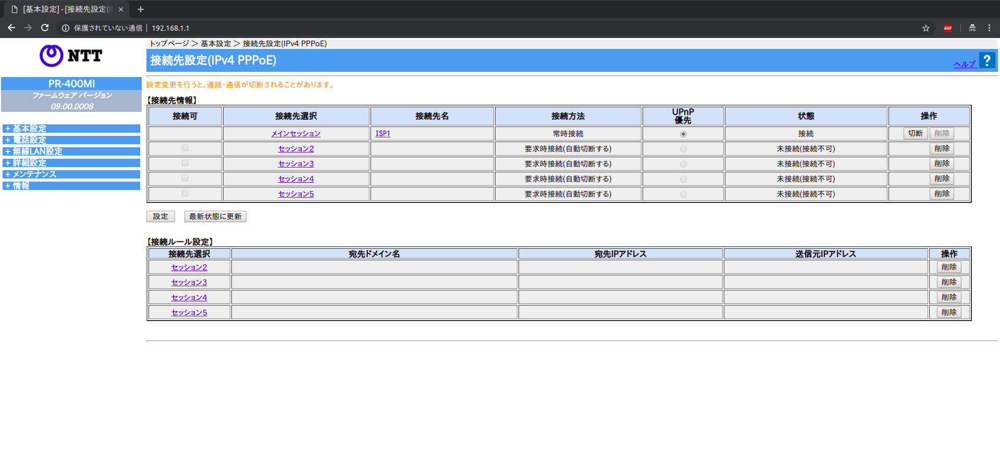
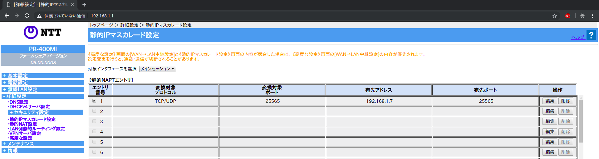
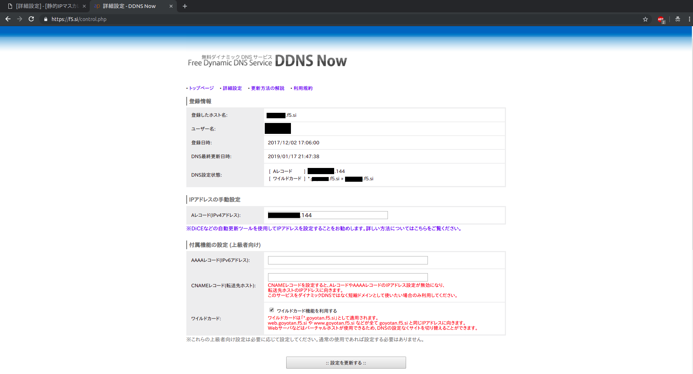

## 概要

    こんにちは。初めて記事を書きます。お手柔らかにお願いします。

    今回はDDNSを用いてMinecraftサーバを構築していきたいと思います。DDNSを用いることで、グローバルIPアドレスが変動する環境においても固定されたドメインを得ることができます。

## 目次
- Javaのインストール
- Minecraftサーバの構築
- NAT or NAPT設定
- DDNSの設定
- 運用について

## 本記事で使用する環境と知識
- Ubuntu Server 18.04 LTS (64bit)
- Oracle JDK8
- NAT,NAPTの知識
- デフォルトゲートウェイ(ルータ)へのアクセス方法

## Javaのインストール

    ここでは、Minecraftサーバを動作させるために必要なJava(JDK)をインストールします。SSH or サーバのターミナルを用いて作業をしていきます。

1. リポジトリを追加します。
    ```
    $ sudo add-apt-repository ppa:webupd8team/java
    [ENTER]
    $ sudo apt update
    ```

1. apt経由でJDKをインストールします。
    少し時間かかりますので、ゆっくり待ちます。
    ```
    $ sudo apt install oracle-java8-set-default
    ```

1. 確認
    インストールができたら、JDKの確認をします。
    ```
    $ javac -version
    ```
    バージョンが表示されたら、JDKのインストールは完了です。


## Minecraftサーバの構築

    ここでは、Mincraftのサーバプログラムをダウンロードし初期動作を行います。

1. Minecraftサーバプログラムのダウンロード
    [Minecraft公式ページ](https://minecraft.net/ja-jp/download/server/)からダウンロードします。ブラウザからダウンロードしてもOKですが、今回は`wget`コマンドを使用してダウンロードします。
    記事作成時の最新バージョンは`1.13.2`です。
    ```
    $ wget https://launcher.mojang.com/v1/objects/3737db93722a9e39eeada7c27e7aca28b144ffa7/server.jar
    ```
    ダウンロードが完了すると、ディレクトリに`server.jar`ファイルが存在することが確認できます。

1. 初期動作
    `server.jar`をダウンロードしたら、わかりやすいように`server`というディレクトリに移動させます。
    ```
    $ mkdir server
    $ cp server.jar server
    $ cd server
    ```
    次は初期動作です。Minecraftを遊ぶには、`EULA`と呼ばれる使用許諾契約に同意しなければいけません。サーバ初期起動時には、同じディレクトリに複数のファイルが生成されます。その中に、`eula.txt` というファイルが生成されます。このファイルを編集して同意します。

    ```
    $ java -jar server.jar nogui
    ```
    初期起動をすると、以下のようなログが出力されます。
    ```
    ~~~省略~~~
    [21:26:09] [main/INFO]: Loaded 0 recipes
    [21:26:09] [main/INFO]: Loaded 0 advancements
    [21:26:09] [Server thread/INFO]: Starting minecraft server version 1.13.2
    [21:26:09] [Server thread/INFO]: Loading properties
    [21:26:09] [Server thread/WARN]: server.properties does not exist
    [21:26:09] [Server thread/INFO]: Generating new properties file
    [21:26:09] [Server thread/WARN]: Failed to load eula.txt
    [21:26:09] [Server thread/INFO]: You need to agree to the EULA in order to run the server. Go to eula.txt for more info.
    [21:26:09] [Server thread/INFO]: Stopping server
    [21:26:09] [Server thread/INFO]: Saving worlds
    [21:26:09] [Server Shutdown Thread/INFO]: Stopping server
    [21:26:09] [Server Shutdown Thread/INFO]: Saving worlds
    ```
    次に、`eula.txt`を編集します。
    ```
    $ nano eula.txt
    ```
    `nano`エディタを用いて編集します。中身は以下のようになっています。
    ```
    #By changing the setting below to TRUE you are indicating your agreement to our EULA (https://$
    #Fri Feb 08 21:26:09 JST 2019
    eula=false
    ```
    最後の行にある`eula=false`を`eula=true`に変更します。
    ```
    #By changing the setting below to TRUE you are indicating your agreement to our EULA (https://$
    #Fri Feb 08 21:26:09 JST 2019
    eula=true
    ```
    `nano`エディタで上書き保存するには、`Ctrl+w`の後に`Y`を入力し、ファイル名を確認の上でEnterキーを押します。


1. 動作確認
    さて、初期設定は完了したのでテストとしてサーバを起動します。
    ```
    $ java -jar server.jar nogui
    ```
    サーバを起動すると以下のようなログが出力されます。
    ```
    ~~~省略~~~
    [21:35:13] [Server thread/INFO]: Preparing spawn area: 88%
    [21:35:13] [Server thread/INFO]: Preparing spawn area: 92%
    [21:35:14] [Server thread/INFO]: Preparing spawn area: 96%
    [21:35:14] [Server thread/INFO]: Preparing spawn area: 100%
    [21:35:14] [Server thread/INFO]: Time elapsed: 14431 ms
    [21:35:14] [Server thread/INFO]: Done (25.659s)! For help, type "help"
    ```
    この状態になったら、サーバは正常に起動しています！
    やったね！

1. テストでワールドに参加してみる
    もし、サーバを構築しているマシンでMinecraftを起動しているのなら`localhost:25565`でログインできます。
    それ以外の場合、サーバのローカルIPアドレスを指定してログインします。
    ```
    $ ifconfig
    ```
    `inetアドレス`にあるアドレスを確認します。`192.168.1.7`と仮定します。
    `192.168.1.7:25565`でサーバにログインできます。

## NAT or NAPT設定
    ローカルに建っているサーバを外部(Internet)に公開します。そのためには、ルータの設定を変更し、外部から`25565`番ポートへのアクセスを許可します。
    ルータの種類によってはUIが異なりますが、本質的には同じなので頑張って設定してみよう。

1. ルータへアクセスする
    ここからは筆者の環境で行います。`192.168.1.1`が私の環境のデフォルトゲートウェイです。
    `http://192.168.1.1`にブラウザでアクセスします。ログインを求められるので、ログインをします。

    

1. NAT or NAPTの設定をする
    今回は`25565<--->25565`のポート変換ですが、NAPTを設定しています。
    同ポート間のアドレス変換なのでNATでももちろん可能

    

    上の画像の例では以下のようなネットワークとなっています。
    ```
    Internet
        |
        |
        | --- Global IP Address
        |
        |
    (X.X.X.X:25565)
      Gateway --- IP変換(Global<--->Local)
    (192.168.1.1)
        |
        |
        | --- Local IP Address
        |
        |
      Server
    (192.168.1.7:25565)

    X.X.X.XはグローバルIPアドレス
    ```

1. 外部からアクセスして確認
    前項ではNAT or NAPTで設定をしました。正常に設定出来てるならば、グローバルIPアドレスを元にMinecraftサーバへアクセスすることができます。
    `X.X.X.X:25565`でログインしてみよう！

## DDNSの設定
    ルータは再起動等が起きると、グローバルIPが変動します。つまり、前項の設定ではグローバルIPを皆に通知しないとログインできなくなります。
    そこで、`DDNS`というものを利用して、`X.X.X.X:25565 <---> boyon.hoge:25565`のように独自ドメインを持つことができます。また、IPが変動しても、設定をしていれば自動でこの対応が持続します。

1. DDNSサービスを利用します
    今回では無料で利用できる`https://f5.si/`を利用します。アカウントを作成すると、グローバルIPを設定することで、`アカウント名.f5.si`というドメインと対応付けすることができます。

2. f5.siで設定
    `アカウント名.f5.si`とサーバのグローバルIPを対応させます。以下の画像のように設定します。

    

    設定を更新すれば、`アカウント名.f5.si:25565`でMinecraftサーバにログインすることができます。

3. グローバルIPの通知設定
    IPアドレスに変動が起きた場合に、現在`アカウント名.f5.si`に対応付けされているグローバルIPを更新します。通知に用いるプログラムは`DiCE`と呼ばれるもので、[公式サイト](https://f5.si/setupinfo.php)に設定方法が書いてあります。また、APIも公開されているので、通知プログラムを自分で作成してみるのも楽しいです。


## 運用について
    さてさて、ここまで全て成功すれば見事にお家Minecraftサーバの完成です！！！
    おめ！！！ イェーーーーイ！！！！

    あとは、`server`ディレクトリにある`server.properties`等を編集して好みサーバにしましょう。
    また、以下のような設定を行うことでよりサーバを管理しやすくなります。

1. Minecraftサービスをsystemdに登録する
    [設定](https://minecraft.server-memo.net/minecraftserver-3/#systemd)こちらの設定を行うことで、`systemctl`コマンドを利用してMinecraftサービスの自動起動、再起動、ステータス確認、停止を行うことができて便利です。

2. 独自拡張機能
    Minecraftサーバのログを収集することで、誰がログインしたかなどを知ることができます。`journalctl`コマンドを利用したり、プログラミング言語のライブラリ等を使用することで、色々な機能を実装することができます。筆者はログインすると自動でツイートするスクリプトを組んでいます。
    ぜひ、皆さんもチャレンジしてみてください！！！

